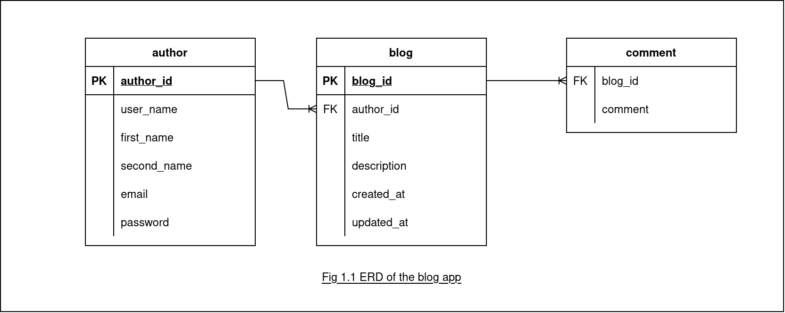

# A simple blog rest api made using nestjs

## Operations supported
### For Blog:

* GET: `/blog`
* GET: `/blog/:id`
* POST: `/blog`
* PATCH: `/blog:id`
* DELETE: `/blog:id`

*Send the json body for post and patch for blog as:*
> note: for patch, body sections are optional and only those attribute supplied with json body will be updated
```json
{
	"title":"title-string",
	"description": "description-string",
	"author": "author-name-string"
}
```

### Schema


#### Self Notes
* `blog` module is responsible for blog related operations are responsible
* For database typeorm is used with postgres being setup using docker which specification is provided by `docker-compose.yml`
* use the below command to fire up docker
	```bash 
	docker compose up -d 
	```
* If docker throws an error of *port already being used* then follow these steps
	1. List the docker containers currently active
	```bash
	docker container ls 
	```
	2. Remove the docker container currently running to free the ports
	```bash
	docker rm -f <CONTAINER ID>
	```
* Some important links for reference and tutorials
  * [nestjs docs](https://docs.nestjs.com/)
  * [typeorm docs](https://typeorm.io/)
